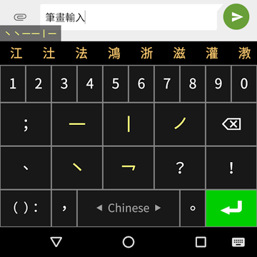

# Stroke Input Method (筆畫輸入法) for Android

A minimalist Chinese keyboard where you input characters
by typing stroke sequences (e.g. 天 is ㇐㇐㇒㇔).

Uses [Conway Stroke Data].

[Conway Stroke Data]: https://github.com/stroke-input/stroke-input-data

## Features

* Good character support (over 28k characters) including vernacular Cantonese
* User preference for traditional or simplified characters
* No permissions, tracking, etc.
* Deterministic candidate generation which doesn't learn user input

## Releases

[][f-droid]
[][google-play]

[f-droid]: https://f-droid.org/en/packages/io.github.yawnoc.strokeinput/
[google-play]: https://play.google.com/store/apps/details?id=io.github.yawnoc.strokeinput

- [Privacy Policy (English version)](PRIVACY.md#privacy-policy-english-version)
- [私隱政策（中文版）](PRIVACY-zh.md#私隱政策中文版)

## License

**Copyright 2021–2025 Conway**  
Licensed under the GNU General Public License v3.0 (GPL-3.0-only).  
This is free software with NO WARRANTY etc. etc., see [LICENSE].  

For detailed copyright information in relation to dependencies,
see [app/src/main/assets/about.html].

## Help (for users)

### Strokes

| Key | Stroke |
| - | - |
| ㇐ | horizontal; raise |
| ㇑ | vertical; vertical-with-hook |
| ㇒ | left-slash |
| ㇔ | right-press; dot |
| ㇖ | turn; bend |

### Examples

| Character | Stroke sequence |
| - | - |
| 天 | ㇐㇐㇒㇔ |
| 下 | ㇐㇑㇔ |
| 為 | ㇔㇒㇖㇖㇖㇔㇔㇔㇔ |
| 公 | ㇒㇔㇖㇔ |

### Miscellaneous

| Action | Function |
| - | - |
| Horizontally swipe space-bar | Change language |
| Long press space-bar | Change to other keyboard |

### Retract keyboard

Use the system <b>Back Button</b> (or <b>Back Gesture</b>) to retract the keyboard.

## Assets (for devs)

### `*.cmd` (CMD)

These are [Conway-Markdown (CMD)] files,
used to compile the HTML files by running `cmd --all`
whilst in the root directory of this repository.

### `*.cmdr` (CMD Rules)

These are files containing CMD Rules used by the CMD files.

### `*.html` (HTML)

These are the actual About and Help files that get served in the app.

### `*.txt` (Text)

These are data files used by the input method.
Taken from Conway Stroke Data ([CC-BY-4.0] / [Public Domain]),
see <<https://github.com/stroke-input/stroke-input-data>>.

### `StrokeInputFont.ttf`

This is the font used for the keyboard.
Taken from Stroke Input Font ([GPL-3.0-only]),
see <<https://github.com/stroke-input/stroke-input-font>>.

### `webview.css`

This is the stylesheet for the HTML files that get served in the app.

[LICENSE]: LICENSE
[GPL-3.0-only]: https://www.gnu.org/licenses/
[CC-BY-4.0]: https://creativecommons.org/licenses/by/4.0/
[Public Domain]: https://creativecommons.org/publicdomain/zero/1.0/
[app/src/main/assets/about.html]:
  https://htmlpreview.github.io/?https://github.com/stroke-input/stroke-input-android/blob/master/app/src/main/assets/about.html
[Conway-Markdown (CMD)]:
  https://github.com/conwaymd/conwaymd
